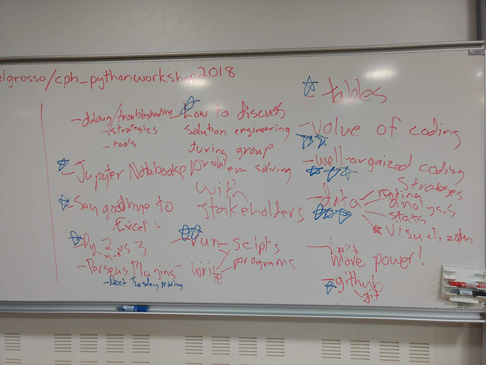

# Workshop: "Intro to Scientific Programming in Python"

To Run the Exercises Online: 

## Course Overview

### Day 0
Together, we identified many things we wanted to come away with in the course:

ipywidgets
https://ipywidgets.readthedocs.io/en/stable/

## Additional Learning Resources

  - Data Science Handbook (Jupyter Notebooks): https://github.com/jakevdp/PythonDataScienceHandbook
  - Python News Subreddit: https://www.reddit.com/r/python
  - Python Learning subreddit (good for asking hard-to-google questions when starting out): https://www.reddit.com/r/learnpython
  - Meetup (for open interest groups in copenhagen and abroad): www.meetup.com
  - PyData (for conferences and workshops for further learning): www.pydata.com
  - EuroScipy (scientific conference for python-using scientists): https://www.euroscipy.org/

### The Terminal

Bash Cheat Sheet:  https://learntocodewith.me/command-line/unix-command-cheat-sheet/

Dos Cheat Sheet: https://access.redhat.com/documentation/en-US/Red_Hat_Enterprise_Linux/4/html/Step_by_Step_Guide/ap-doslinux.html

### Intro to Python

Mini Intro to Python Online Resources:  https://pythonfordatascience.org/

Notebooks from VanderPlas' "Python Data Science Handbook": https://github.com/jakevdp/PythonDataScienceHandbook

